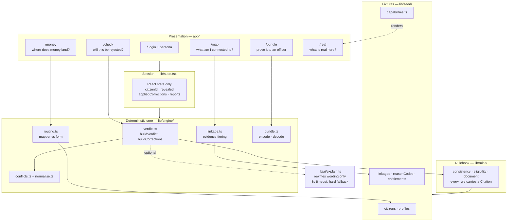
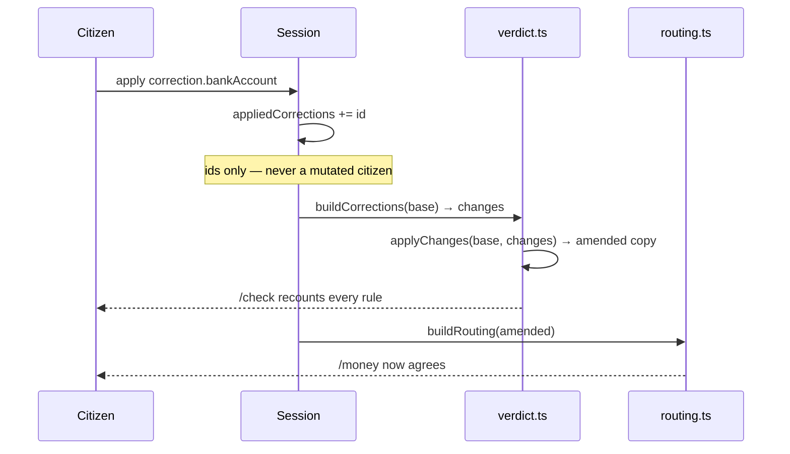
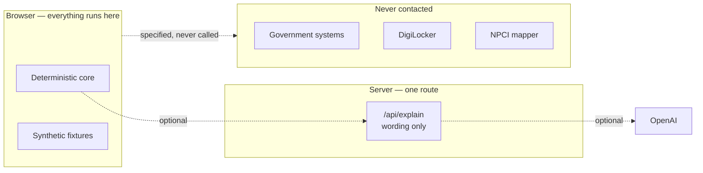

# 00 — System architecture

Read the feature documents first. This one describes only how they compose.

## The one-sentence shape

**A pure deterministic core reads synthetic records, and every screen is a
different question asked of that same core.**

No feature owns its own logic. `/check`, `/map` and `/money` are three
questions put to one engine over one fixture, which is why a correction applied
on one screen changes the answer on another.

## Layers

## The dependency rule

**Presentation may import from engine. Engine may never import from
presentation.** The engine has no React import, no `window`, no `fetch`. That is
what makes it testable and what makes the claim *"deterministic decides"*
verifiable rather than aspirational.

## How a correction propagates

This is the only cross-feature interaction, and it is deliberately the simplest
possible one.

The session stores **correction ids, never a mutated citizen**. The amended
citizen is derived on every render from `base + appliedCorrections`. This is
why "start over" is one line, why nothing can drift out of sync, and why the
seed fixture is provably never mutated — asserted in `tests/verdict.test.ts`.

## Trust boundaries

Every arrow to a government system is a **contract, not a call**. Each feature
document ends with the endpoint a department would expose; nothing in the code
invokes one.

## Why there is no database

| Consequence | Effect |
|---|---|
| No accounts | Reviewers open a URL and are in |
| No breach surface | There is nothing to leak |
| No registry | We cannot become the linkage map we argue against |
| Session dies with the tab | The privacy claim needs no audit to believe |

The cost is real and stated in `05-document-bundle.md`: a two-way status
channel must carry state in signed envelopes rather than rows.

## The integration surface, collected

Every contract in one place. All are **consent-bound, boolean or minimal, and
return no stored values**.

| Feature | Endpoint | Returns |
|---|---|---|
| 01 Linkage | `POST /{domain}/match` | `{ match: boolean }` |
| 02 Verification | `GET /uidai/authentication-history` | events, no content |
| 03 Consistency | `POST /{issuer}/field-match` | `{ match: boolean }` |
| 05 Bundle | `POST /officer/response` | signed envelope |
| 06 Routing | `GET /dbt/routing-status` | bank + seeding date only |

**None of these require new infrastructure.** They are the existing
privacy-preserving pattern — the consent artefact defined by MeitY's Electronic
Consent Framework — extended to a citizen-initiated query.

India already runs this pattern twice: **Account Aggregators** for financial
data, and the **ABDM consent manager** for health records. Both use the same
shape — a consent manager that moves data and stores none, with granular,
revocable, auditable consent. **Government records would be the third.**

## What would have to change to go live

1. **Signing.** Bundles are encoded, not signed. Needs a key, therefore a server.
2. **A requester agreement.** DigiLocker consumption requires being an onboarded
   organisation. There is no tier for a citizen-chosen tool — which is the
   argument, not an excuse.
3. **One department volunteering a probe.** A single `POST /{domain}/match`
   would convert one `unknowable` row into a real answer and prove the pattern.

## Testing

`npm test` — 21 tests over the deterministic core.

The suite asserts the properties the product's claims depend on: seed fixtures
are never mutated, every linkage row carries a citation and a probe contract,
corrections that unblock nothing still change something, and the complete
journey runs with no API key set.
