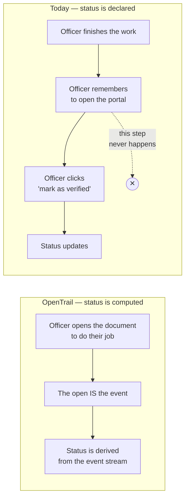
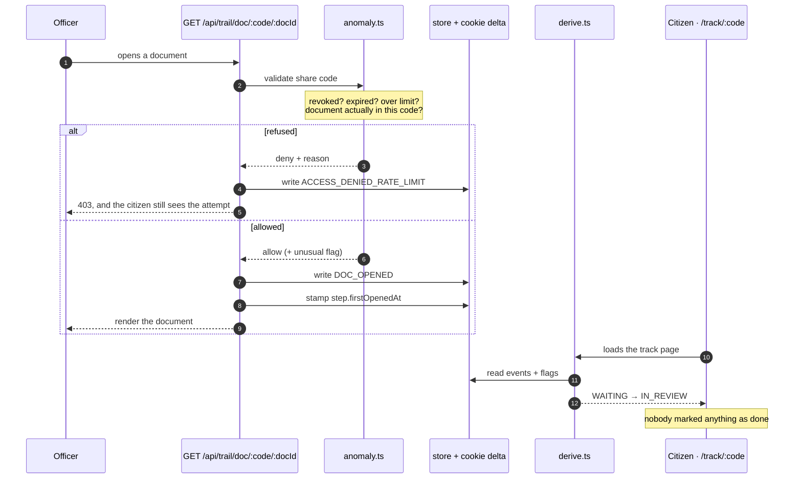
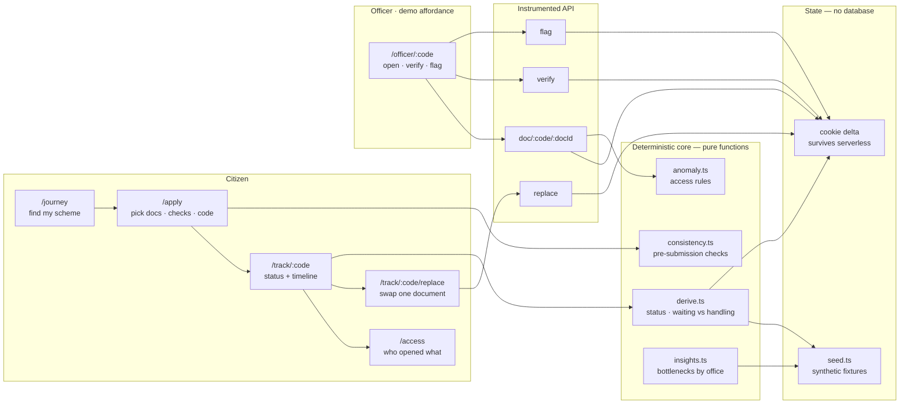
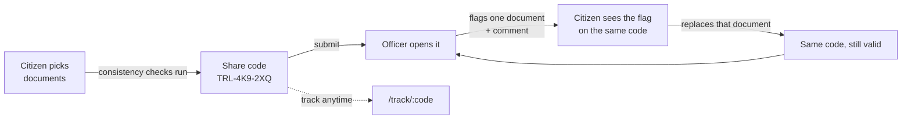

# OpenTrail — how it works

Three diagrams. The first is the whole argument; the other two are the plumbing
around it.

---

## 1. Why status breaks today, and what we do instead

**Nobody has to remember anything.** A document is only rendered at the end of a
logged fetch, so there is no way to view one without producing an event.

---

## 2. The officer request, end to end

This is the path every document view takes. Note the order: the event is written
**before** the document is returned.

---

## 3. Service architecture

**The dependency rule:** screens may import the core; the core imports nothing
from the screens. No React, no `window`, no `fetch` in `derive.ts` — which is
what makes "status is computed" testable rather than asserted.

---

## 4. One share code, both directions

**The same code is the submission and the tracker.** A flag never restarts an
application — one document is replaced, and the code stays valid.
